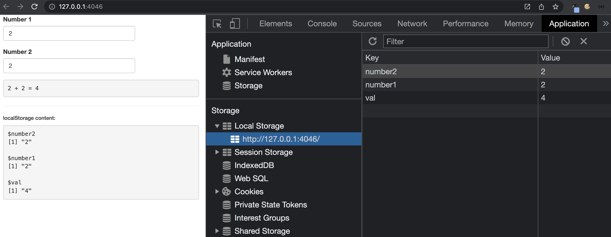

# shinyLocalStorage

<!-- badges: start -->
<!-- badges: end -->

The goal of shinyLocalStorage is to demonstrate the use of the __localStorage__ [API](https://developer.mozilla.org/en-US/docs/Web/API/Web_Storage_API/Using_the_Web_Storage_API#api.window.localstorage) to speed up app performances. 

The demo app is simulating a dummy task for 10 seconds on the first run.
Input and any reactives are stored in the browser __localStorage__, which will speed up any subsequent startup.

## Limitations

- If the app code changes and affects input names, the local storage
must be reset for the user.
- This is different from the shiny cache API since combinations of
input which gave a specific result are not stored. Any new input value,
will erase the existing one.

## Related work

`{shinyStorePlus}` [leverages](https://shinystoreplus.obi.obianom.com/index.html) indexedDB to also store input, output values on the client. 
